# CS360 Introduction to Database
Repository for Term Project of CS360, KAIST, 2019 Spring

## About the Course
The objective of this course is to give the students basic understanding of the database management systems. Topics include file systems, database architecture, conceptual modeling, languages, data design, query processing, relational databases, etc.  
Students will be given reading assignments for better interactions during the following classes. For the best digestion of the classroom learning, students will be given term projects on the design and development of real-world database applications. Teaching assistants will closely guide team students from the proposal to the final presentations.

## About the Project

### System Introduction
In society, companies want job hunters whose abilities are suitable for their work. On the other hand, job hunters need to find the suitable company with their career. So, our system will consider job site database which provides the recommendation for the company or job hunters depend on support condition with user’s data. Our system’s users will be job hunters and HR department of company.

### System Configuration Diagram
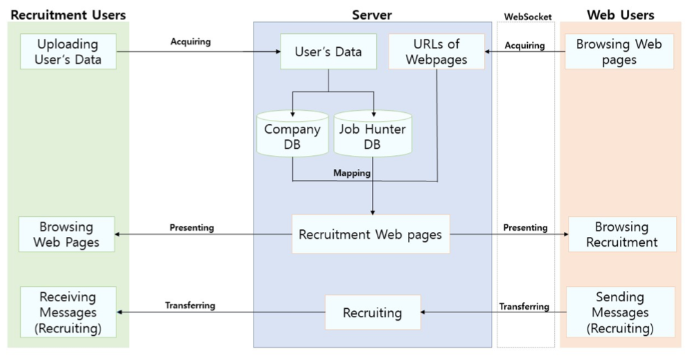

### User Requirements
Our system will include two main functions; 1) uploading user’s information and 2) filtering the company recruitment and job hunters’ data.  
If users (HR department of company or job hunters) want to use our web service, then they should upload their information (career & job condition) on database server. For job hunters, they can fill in their career such as graduate school, GPA, license, etc. Also, for HR department, they can upload their job posting with several condition.  
After uploading user’s information, users can be filtering the company or job hunters to recruitment. If they enter the specific keyword for job such as ‘programming’, then they can get the result related to ‘programming’ like company recruiting developer or people who major in Computer Science.  
In addition, our system will provide message between job hunter and company to help users recruit the job.

### Development Schedule

| week                      | 5   | 6   | 7   | 8   | 9   | 10  | 11  | 12  | 13  | 14  |
| ---                       | --- | --- | --- | --- | --- | --- | --- | --- | --- | --- |
| Proposal                  | O |  |  |  |  |  |  |  |  |  |
| ER modeling               |  | O |  |  |  |  |  |  |  |  |
| Conceptual modeling       |  |  | O |  |  |  |  |  |  |  |
| DB implementation         |  |  |  | O | O | O | O |  |  |  |
| Server implementation     |  |  |  |  | O | O | O | O |  |  |
| Client UI implementation  |  |  |  |  |  | O | O | O | O |  |
| Presentation              |  |  |  |  |  |  |  |  | O | O |

### ER Diagram
Download [Our ERD.pdf](./CS360_Team9_ERD.pdf).

### User's Workflow
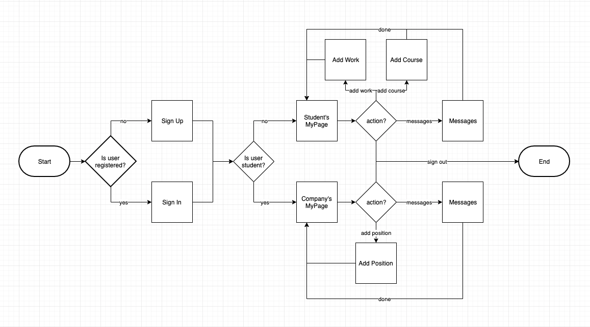

## Screenshots
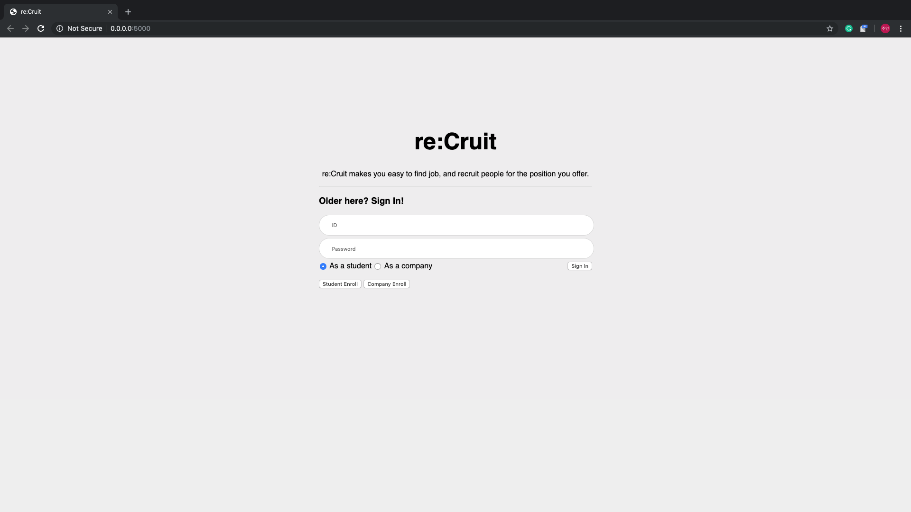  
> Home, Sign In Page  

When users first visit the site, they need to **sign in**. If they don't have account or the given id and password are not match, the register page is open.

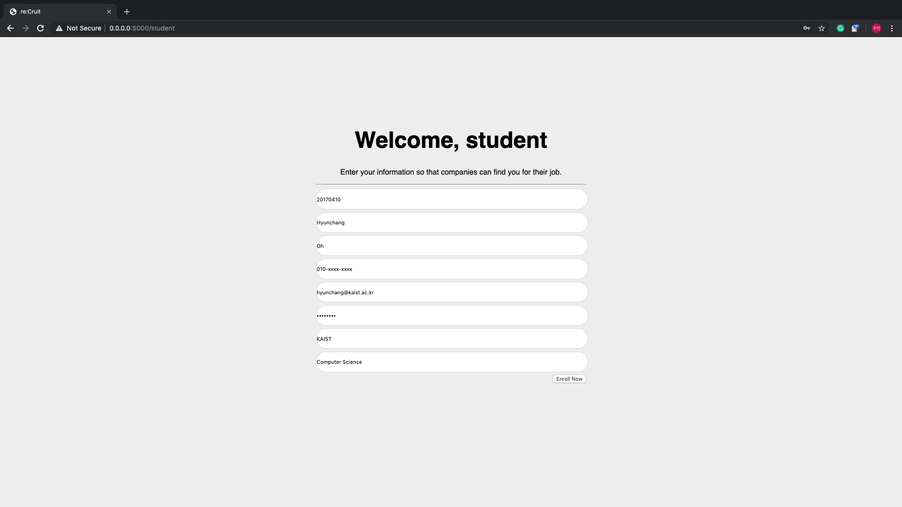
> Student Enroll  

For students who don't have an account yet, they can register their information on the **student enroll** page.

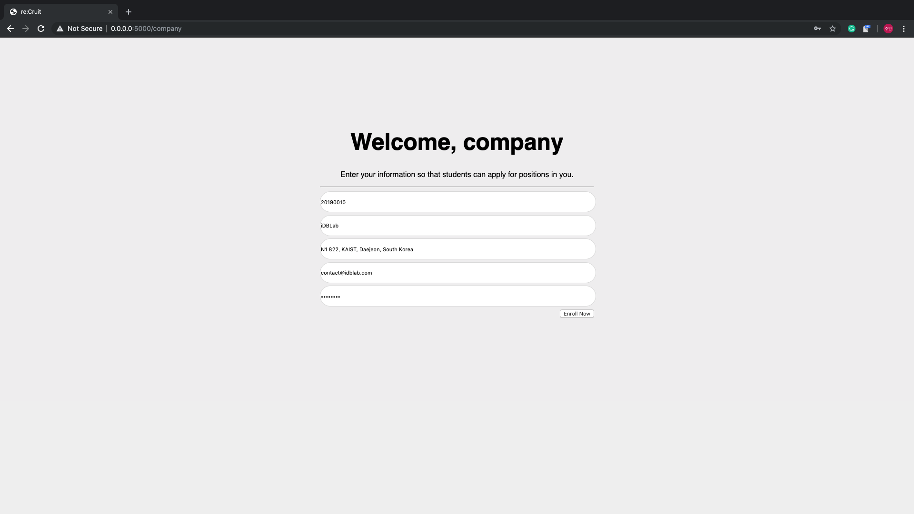
> Company Enroll  

For companies who don't have an account yet, they can register their information on the **company enroll** page.

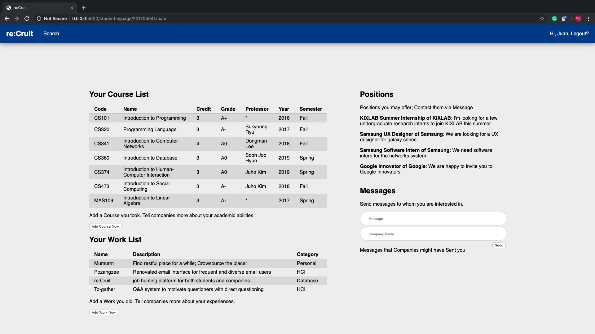
> Student Mypage  

This is the **home** for the students, including **course** list, **work** list, **recommended positions**, and **messages**.  
Students can easily add the courses they have taken and work they have done, and can interact with companies.

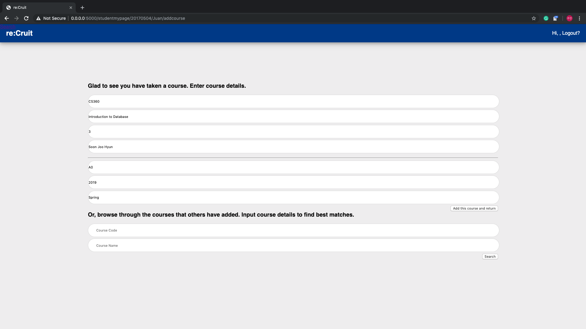
> Add Course  

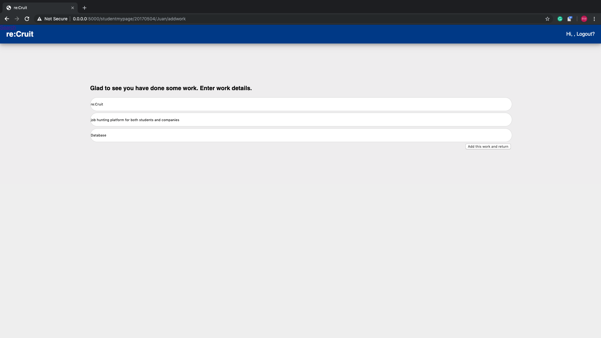
> Add Work  

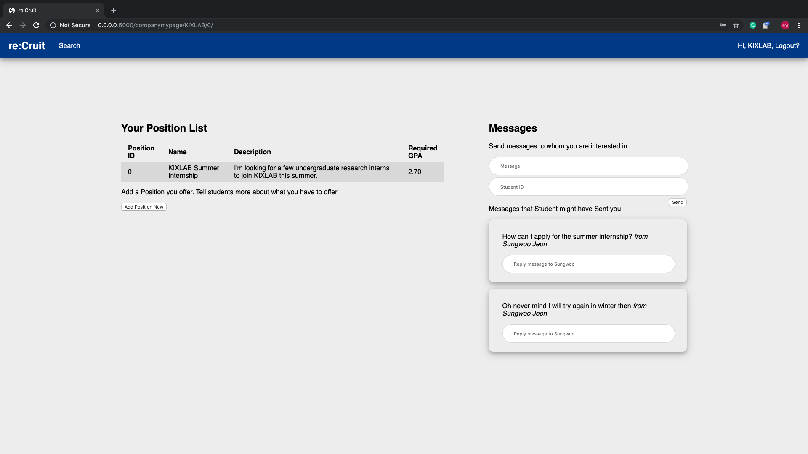
> Company Mypage  

This is the **home** for the companies, including **position** list and **message interface**.
Companies can easily register the positions they want to offer and can interact with students.

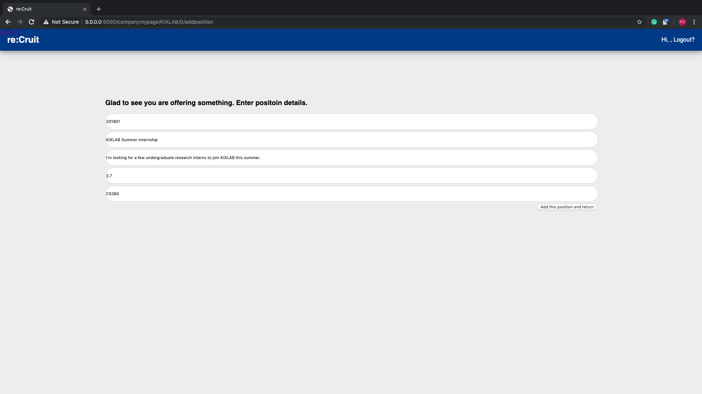
> Add Position  

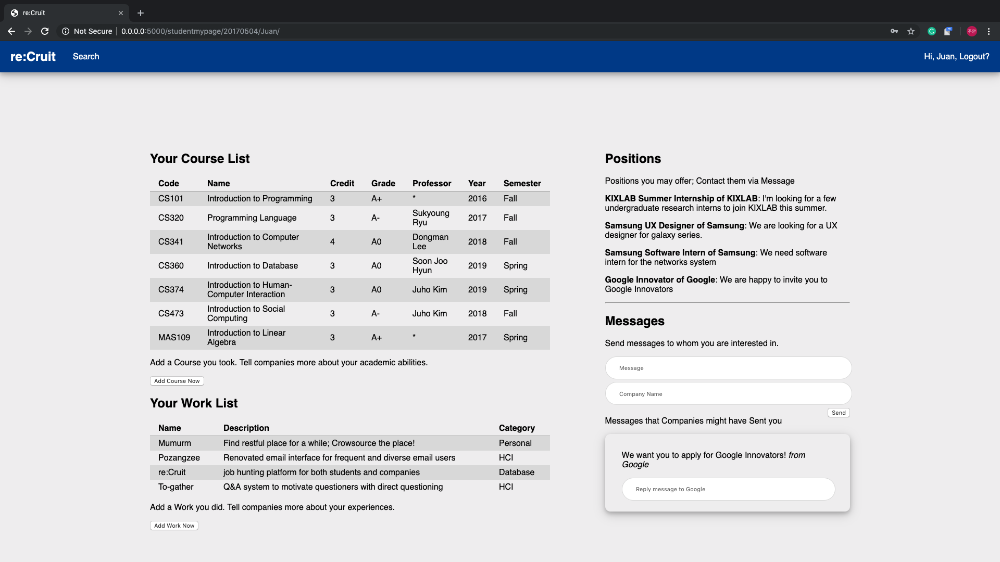
> Message - Student Side  

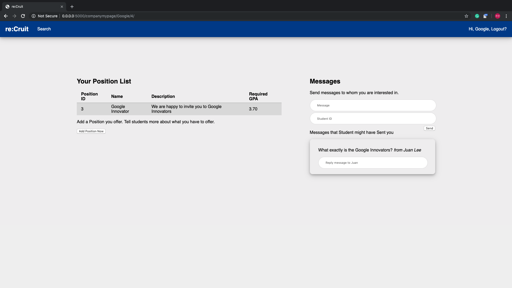
> Message - Company Side  

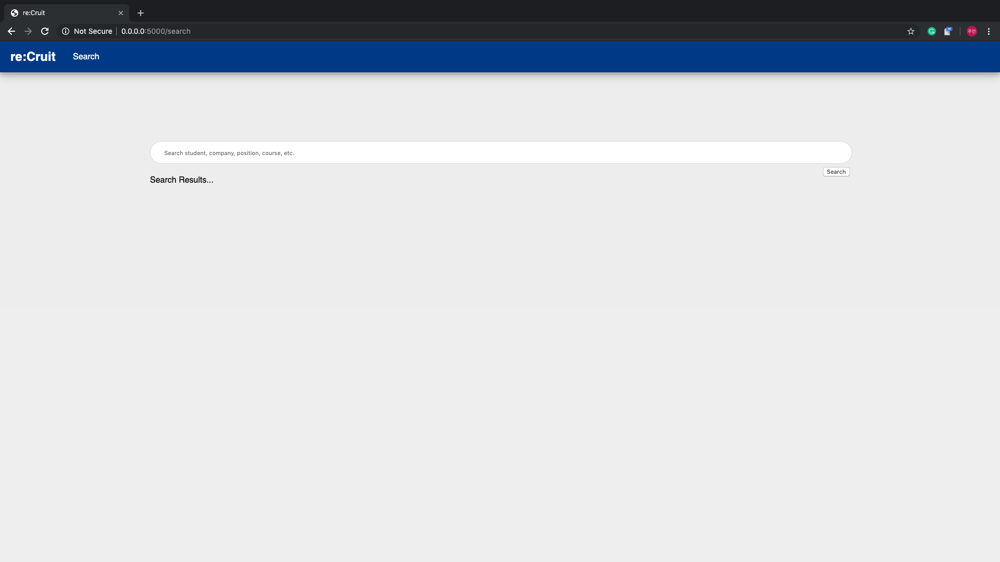
> Search  

We also offer **search** function, which queries all the students, companies, positions and courses.  
This help users use and explore **re:Cruit**.


> Search Result  

## Collaborator
* Juan Lee
* Hyunchang Oh
* Sungwoo Jeon

## How to run?
Before you run, create ```Credentials.py``` and put your own database credentials.

```
pip install Flask
pip install PyMySQL
python3 ./run.py
```